# The Massachusetts Atlas — REWAP Brokerage brand book and website concept

A brand book and website concept for **REWAP Brokerage LLC**, a Massachusetts real estate brokerage based at 652 Park Ave, Worcester, and serving all 351 cities and towns in the state.

> **We understand the place behind the property.**
> Signature line: *Know where you’re moving.*

This repository holds the original Claude Design files and a static site that renders them as live, clickable pages, ready for GitHub Pages.

**Live demo:** <https://cptnope.github.io/REWAP-Brokerage-Concept-2/> (after GitHub Pages is turned on; see [Hosting on GitHub Pages](#hosting-on-github-pages)).

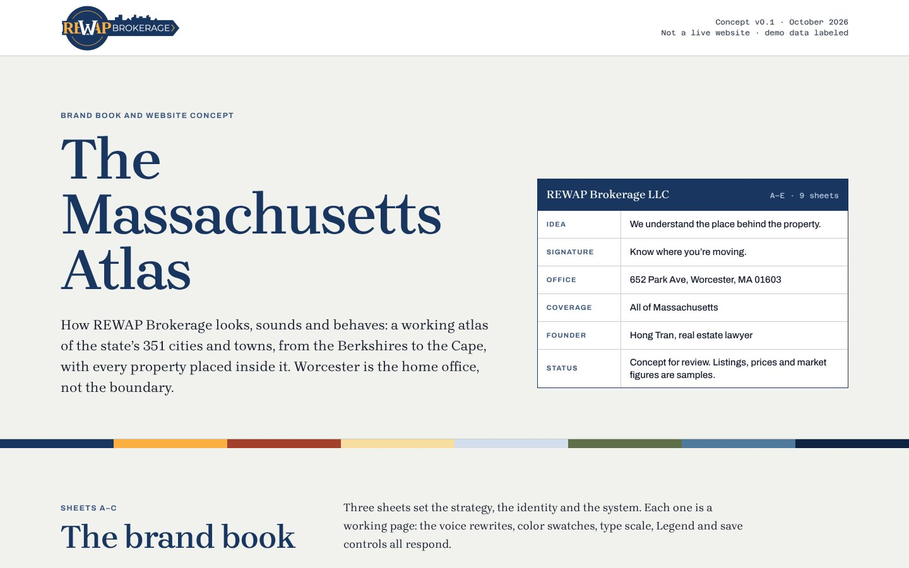

> [!IMPORTANT]
> This is a **concept for review, not a live website**. Listings, prices, comparables and market figures are samples and are labeled as such on every page. Nothing here is MLS data. Bracketed items such as `[Month YYYY]` or `MLS #[00000000]` are placeholders for verified facts and are never published unfilled.

---

## Contents

- [Pages in the demo](#pages-in-the-demo)
- [Sheet A · Strategy and voice](#sheet-a--strategy-and-voice)
- [Sheet B · Mark, color and type](#sheet-b--mark-color-and-type)
- [Sheet C · System and components](#sheet-c--system-and-components)
- [Sheet D · Website concept](#sheet-d--website-concept)
- [Sheet E · Platform and structured data](#sheet-e--platform-and-structured-data)
- [Ground rules](#ground-rules)
- [Open items before launch](#open-items-before-launch)
- [Repository layout](#repository-layout)
- [How the demo works](#how-the-demo-works)
- [Run it locally](#run-it-locally)
- [Hosting on GitHub Pages](#hosting-on-github-pages)
- [Editing the design](#editing-the-design)
- [Credits and licenses](#credits-and-licenses)

---

## Pages in the demo

Every page carries an **Atlas pages** button in the bottom-left corner. It opens a list of all sheets, with previous and next links, so the whole brand book and site can be walked in order.

| Sheet | Page | What it shows | Design file |
|---|---|---|---|
| — | [Overview](https://cptnope.github.io/REWAP-Brokerage-Concept-2/) | Cover, title block and a directory of every sheet | `index.html` |
| **A** | [Strategy and voice](https://cptnope.github.io/REWAP-Brokerage-Concept-2/pages/Main.html) | Positioning, personality, voice, audiences, messaging, naming | `design/project/Main.dc.html` |
| **B** | [Mark, color and type](https://cptnope.github.io/REWAP-Brokerage-Concept-2/pages/Identity.html) | The logo, the material palette, typography | `design/project/Identity.dc.html` |
| **C** | [System and components](https://cptnope.github.io/REWAP-Brokerage-Concept-2/pages/System.html) | Grid, photography, illustration, data, map, icons, motion, components, accessibility | `design/project/System.dc.html` |
| **D1** | [Home](https://cptnope.github.io/REWAP-Brokerage-Concept-2/pages/Home.html) | The statewide Massachusetts Atlas map and the home page | `design/project/Home.dc.html` |
| **D2** | [Area Sheet · Shrewsbury](https://cptnope.github.io/REWAP-Brokerage-Concept-2/pages/Area.html) | The Sheet template for a town | `design/project/Area.dc.html` |
| **D3** | [Property search](https://cptnope.github.io/REWAP-Brokerage-Concept-2/pages/Search.html) | Map and list in sync, Legend, drawn area *(demo data)* | `design/project/Search.dc.html` |
| **D4** | [Listing](https://cptnope.github.io/REWAP-Brokerage-Concept-2/pages/Listing.html) | A listing placed inside its area *(sample)* | `design/project/Listing.dc.html` |
| **D5** | [Mobile search](https://cptnope.github.io/REWAP-Brokerage-Concept-2/pages/MobileSearch.html) | Bottom sheet, Legend screen, listing view in a phone frame *(demo data)* | `design/project/MobileSearch.dc.html` |
| **E** | [Platform](https://cptnope.github.io/REWAP-Brokerage-Concept-2/pages/Platform.html) | Entities, relationships, URLs, JSON-LD, open items | `design/project/Platform.dc.html` |

---

## Sheet A · Strategy and voice

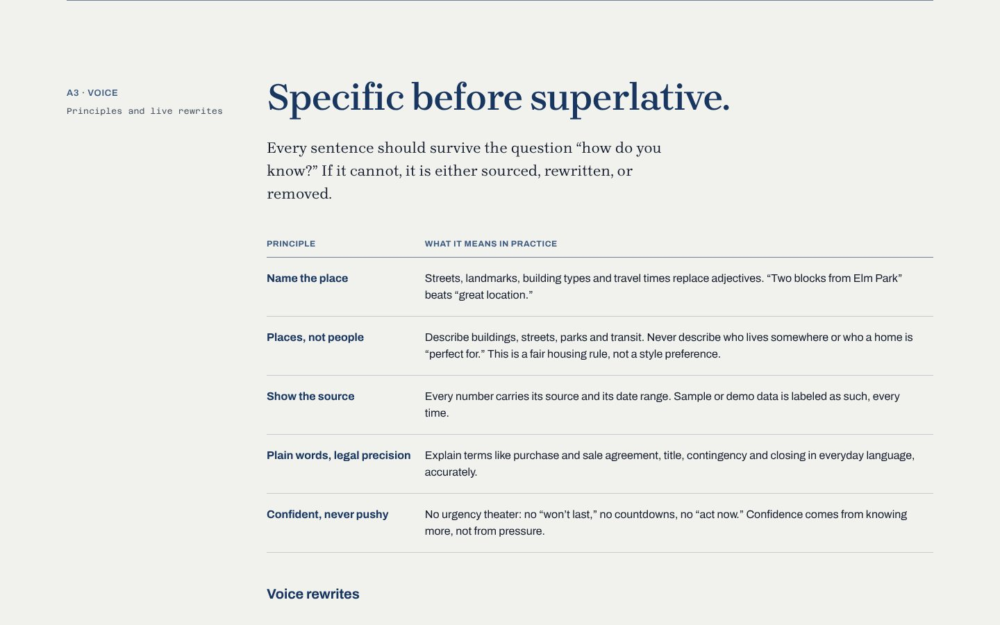

### A1 · The idea

**Most brokerages show inventory. REWAP explains places.** Portals already list every home for sale. What a buyer, seller or investor anywhere in Massachusetts lacks is context: what a street is like, what the housing stock is made of, what is changing nearby, and what the paperwork means.

**Positioning**

| | |
|---|---|
| **For** | People buying, selling and investing anywhere in Massachusetts, |
| **REWAP is** | the Massachusetts brokerage, based in Worcester in the middle of the state, that explains the place behind every property: its streets, building types, landmarks, commutes and direction of travel, |
| **So that** | every decision is made with clear guidance and earned confidence. |
| **Unlike** | portals that treat homes as interchangeable inventory, REWAP is founded by a real estate lawyer, Hong Tran, and publishes original, sourced knowledge of the region. |

- **Purpose: make Massachusetts legible.** Turn a state of 351 cities and towns, from mill cities and coastal villages to hill towns and suburbs, into something a newcomer can read and a lifelong resident can trust.
- **Promise: you will understand the place and the paper.** Context about where you are moving, and plain-English clarity about what you are signing. The second half is what a lawyer-founded brokerage can promise credibly.

### A2 · Personality

*A neighbor who reads the land records.* REWAP sounds like the most informed person on the street: someone who has walked it, pulled the deed and knows what the zoning board decided last spring, and who tells you plainly.

| Trait | Is | Is not |
|---|---|---|
| **Grounded** | Specific about streets, buildings and distances. Names real places. | Folksy, nostalgic or sepia-toned about the past. |
| **Exacting** | Precise, sourced and dated. Shows its working, like a lawyer would. | Legalistic, cold or hiding behind disclaimers. |
| **Generous** | Shares what it knows before anyone signs anything. | Gatekeeping useful information behind a lead form. |
| **Civic** | Proud of the state’s real character: mill cities, hill towns, the coast, three-deckers, redevelopment. | Boosterish. Never pretends a place is something it is not. |

### A3 · Voice: specific before superlative

Every sentence should survive the question “how do you know?” If it cannot, it is sourced, rewritten or removed.

| Principle | In practice |
|---|---|
| **Name the place** | Streets, landmarks, building types and travel times replace adjectives. “Two blocks from Elm Park” beats “great location.” |
| **Places, not people** | Describe buildings, streets, parks and transit. Never describe who lives somewhere or who a home is “perfect for.” A fair housing rule, not a style preference. |
| **Show the source** | Every number carries its source and its date range. Sample or demo data is labeled every time. |
| **Plain words, legal precision** | Explain purchase and sale agreement, title, contingency and closing in everyday language, accurately. |
| **Confident, never pushy** | No urgency theater: no “won’t last,” no countdowns, no “act now.” |

**Voice rewrites** (interactive on the page)

| Context | Category default | REWAP |
|---|---|---|
| Listing remarks | “Stunning move-in-ready gem in a highly desirable neighborhood! Perfect for families. Won’t last!” | “Three-family on a corner lot, two blocks from [street]. Owner’s unit on the top floor; [n] units currently rented. Roof replaced [year]. Ask us what the inspection found.” |
| Area introduction | “Shrewsbury is a great place to live, with top-rated schools, a safe community and something for everyone!” | “Shrewsbury sits east of Worcester across Lake Quinsigamond, with Route 9 running through its center. Housing ranges from older farmhouses and capes to newer subdivisions.” |
| Market note | “The market is HOT! Now is the best time to buy!” | “Readings for [month]: median sale price and days on market in [area], from [MLS source], [n] closed sales. What this means for a buyer, and what it does not tell you.” |
| Seller outreach | “Thinking of selling? We’ll get you top dollar FAST! Free home valuation!” | “Before you list, we walk the property, pull the recorded deed and plot plan, and compare sales of the same building type nearby. Then we talk about price.” |
| Error message | “Oops! Something went wrong.” | “We couldn’t load listings for this area. The map and the Area Sheet still work. Try again, or keep reading while we reconnect.” |

### A4 · Audiences, defined by their question

Audiences are defined by what they are trying to decide, never by demographics. That keeps the work useful and keeps REWAP clear of steering.

| Who | Their question | What the Atlas gives them |
|---|---|---|
| First-time buyers | “Where can I afford to live, and what am I actually agreeing to?” | Area Sheets by housing type, a buying guide that explains every document in order, saved searches tied to places. |
| Relocating and moving-up households | “Which town fits how we live and how we commute?” | Town-to-town and region-to-region comparison on the map, commute overlays to rail and highways, landmarks and parks on each Sheet. |
| Sellers | “What is my place worth, and how do I sell it well?” | Comparable sales within the same building type, a document-readiness checklist, a listing page that sells the place. |
| Investors | “Which blocks and building types make sense to own?” | Multifamily and mixed-use context from the mill cities to the suburbs, links to official permit and zoning sources, sourced readings, never projected returns. |
| Agents, teams and partners | “Can I build my practice under REWAP without losing my identity?” | A clear affiliation model, compliant team branding, agent pages that inherit the Atlas. |

### A5 · Messaging cascade

| Level | Message | Where it lives |
|---|---|---|
| Idea | We understand the place behind the property. | About page, brand moments, agent onboarding |
| Signature | Know where you’re moving. | Home page, signage, social profile line |
| Buy | Read the street before you make the offer. | Buying guide, buyer consultation |
| Sell | Price the place, not only the square footage. | Seller guide, listing presentations |
| Invest | Know the block before the numbers. | Investor guide, multifamily listings |

**Proof REWAP can use:** original Area Sheets, researched and dated · MLS data with its source, date range and sample size · the founder’s background as a real estate lawyer · transactions and reviews, once real and verifiable · official public sources (MassGIS, municipal sites, MBTA).

**Claims REWAP never makes:** “#1,” “top-rated,” awards or rankings it cannot document · sales volume, review counts or client numbers before they exist · “safe,” “family-friendly,” “exclusive” or any description of residents · guaranteed prices, timelines or returns · unsourced or undated statistics.

### A6 · The Atlas vocabulary

| Name | What it is | URL pattern |
|---|---|---|
| **The Atlas** | The whole knowledge layer: map, Sheets, Field Notes and Readings together | `/atlas/` |
| **Sheets** | One deep, maintained guide per region, city, town or neighborhood. The organic-search moat. | `/regions/{region}/` · `/areas/{town}/` · `/areas/{city}/{neighborhood}/` |
| **Field Notes** | Editorial: buying and selling guides, local development, architecture, how-tos | `/field-notes/{slug}/` |
| **Readings** | Dated, sourced market data panels, always labeled with source and period | component |
| **Title Block** | The signature component, borrowed from architectural drawings, that states who prepared what | component |
| **Legend** | Search filters, presented the way a map legend explains its symbols | component |

---

## Sheet B · Mark, color and type

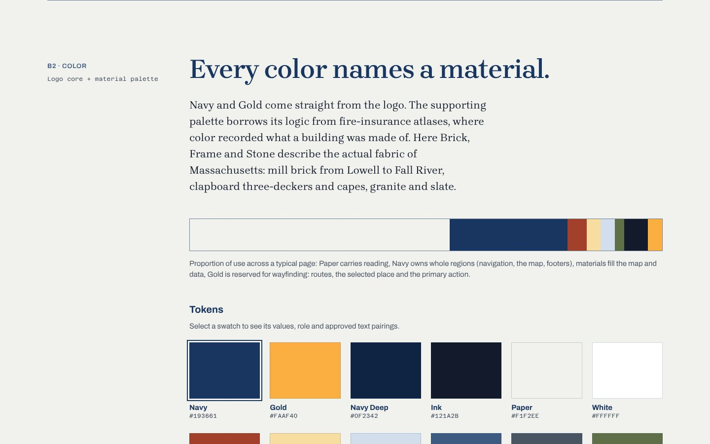

### B1 · The mark

**The current REWAP logo stays exactly as it is.** A navy key carrying the REWAP wordmark in gold and white, with a skyline along its shaft. The Atlas system is designed around it rather than replacing it.

<p>
  
  &nbsp;&nbsp;
  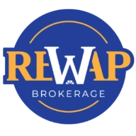
</p>

- **Clear space:** x = one quarter of the logo’s height on every side.
- **Minimum size:** horizontal logo 150 px on screen, 1.5 in in print; compact mark 32 px.
- **Grounds:** Paper, White or Frame tint. On Navy or photography, place it on a paper **Title Block lockup**: a plate holding the logo and a small set of facts, like the title block on an architectural drawing.
- **Misuse:** directly on Navy; stretched or condensed; recolored (including seasonal or material colors); rotated, shadowed or given effects.
- **Production notes:** the only public logo files are a 380 px PNG and a 300 px PNG, so **vector masters (SVG or EPS) are needed before launch**. Because the mark already contains a key, a roofline and a skyline, the rest of the system never repeats those motifs; it speaks about place instead: parcels, streets, materials and terrain.

### B2 · Color: every color names a material

Navy and Gold come straight from the logo. The supporting palette borrows its logic from **fire-insurance atlases**, where color recorded what a building was made of. Brick, Frame and Stone describe the actual fabric of Massachusetts: mill brick from Lowell to Fall River, clapboard three-deckers and capes, granite and slate.

Proportion of use: **Paper** carries reading, **Navy** owns whole regions (navigation, the map, footers), **materials** fill the map and data, **Gold** is reserved for wayfinding (routes, the selected place, the primary action).

| Swatch | Name | Token | Hex | OKLCH | Source | Role |
|---|---|---|---|---|---|---|
|  | Navy | `--navy` | `#193661` | `oklch(33.5% 0.084 258.2)` | REWAP logo, the key | Navigation, the map field, footers, primary buttons |
|  | Gold | `--gold` | `#FAAF40` | `oklch(80.7% 0.149 72.8)` | REWAP logo, the wordmark | Wayfinding only: routes, selected place, focus, one primary action per view |
|  | Navy Deep | `--navy-deep` | `#0F2342` | `oklch(25.8% 0.064 258.9)` | Navy, darkened | Footers, dark map basemap |
|  | Ink | `--ink` | `#121A2B` | `oklch(21.9% 0.036 264.4)` | Survey ink | Body text, fine linework |
|  | Paper | `--paper` | `#F1F2EE` | `oklch(95.9% 0.005 117.9)` | Winter daylight on survey paper | The reading ground. Cool, never cream. |
|  | White | `--white` | `#FFFFFF` | `oklch(100% 0 0)` | Plate stock | Title Block, inputs, comparison panels |
|  | Brick | `--brick` | `#A3402B` | `oklch(50.3% 0.136 33.6)` | Mill brick: Lowell, Lawrence, Worcester, Fall River | Brick buildings, data emphasis, errors |
|  | Frame | `--frame-tint` | `#F7DDA0` | `oklch(90.5% 0.083 87.5)` | Clapboard; a softened Gold | Wood-frame buildings, highlighted rows |
|  | Stone | `--stone-tint` | `#D3DEEC` | `oklch(89.6% 0.023 254.4)` | Granite and slate | Masonry and civic buildings, neutral fills |
|  | Stone Ink | `--stone-ink` | `#3D5A80` | `oklch(46.2% 0.071 255.5)` | Stone, deepened for text | Sheet references, legend labels |
|  | Slate | `--slate` | `#4A5563` | `oklch(44.5% 0.027 254.5)` | Roof slate | Secondary text, captions, metadata |
|  | Lichen | `--lichen` | `#5F7048` | `oklch(52.0% 0.063 127.2)` | Parks, conservation land, stone walls | Open land; positive states |
|  | Water | `--water` | `#4F7A9C` | `oklch(56.2% 0.071 243.4)` | The coast, the Quabbin, the rivers | Water bodies (fill only) |
|  | Mist | `--mist` | `#AFC0D6` | `oklch(80.2% 0.036 254.9)` | Winter sky over the hills | Secondary text and contours on Navy |
|  | Gold Ink | `--gold-ink` | `#7A4E00` | `oklch(46.2% 0.099 72.2)` | Gold, deepened for text | Gold meaning as text on light grounds |
|  | Paper 2 | `--paper-2` | `#E3E6E0` | `oklch(92.1% 0.009 128.6)` | Paper, one tone down | Alternate bands, map land |
|  | Brick tint | `--brick-tint` | `#EDCFC6` | `oklch(87.7% 0.036 37.4)` | Atlas pink for brick | Light-map brick, error backgrounds |
|  | Lichen tint | `--lichen-tint` | `#D7DEC6` | `oklch(88.9% 0.033 120.3)` | Lichen, softened | Light-map parks, success backgrounds |

**Approved text pairings** (WCAG 2.2; AA needs 4.5:1 for body text, 3:1 for large text and interface marks)

| Pairing | Ratio | Grade |
|---|---|---|
| Ink on Paper | 15.5:1 | AAA |
| Navy on Paper · Paper on Navy | 10.7:1 | AAA |
| Ink on Gold | 9.3:1 | AAA |
| Navy on Frame | 9.1:1 | AAA |
| Mist on Navy · Gold on Navy | 6.5:1 | AA |
| Slate on Paper | 6.7:1 | AA |
| Gold Ink on Paper | 6.4:1 | AA |
| White on Brick · Stone Ink on Paper | 6.3:1 | AA |
| Brick on Paper | 5.6:1 | AA |
| Lichen on Paper | 4.8:1 | AA |
| Water on Paper | 4.1:1 | Large text only |
| Stone on Paper | 2.6:1 | Fill only |

Gold is never text on a light ground.

### B3 · Typography: the editor, the signmaker, the surveyor

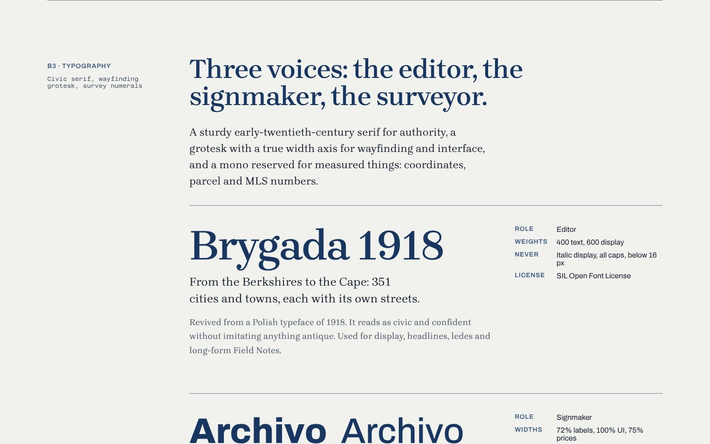

| Voice | Typeface | Use | Weights | Rules |
|---|---|---|---|---|
| **Editor** | [Brygada 1918](https://fonts.google.com/specimen/Brygada+1918) | Display, headlines, ledes, long-form Field Notes. A revival of a Polish typeface of 1918: civic and confident without imitating anything antique. | 400 text, 600 display | Never italic display, all caps, or below 16 px |
| **Signmaker** | [Archivo](https://fonts.google.com/specimen/Archivo) (width axis 62–125%) | Condensed caps letter the map and the Legend like street signs; regular width runs the interface; condensed bold sets prices. | 400, 600, 700 · widths 72% labels, 100% UI, 75% prices | |
| **Surveyor** | [Azeret Mono](https://fonts.google.com/specimen/Azeret+Mono) | Only where something was measured or recorded: coordinates, MLS and parcel numbers, ZIP codes, sources and dates. | 400, 500 · 12–16 px | Never decoration |

**Responsive type scale** (desktop / mobile, px; sizes interpolate with `clamp()`)

| Token | Desktop | Mobile | Setting |
|---|---|---|---|
| display | 92 | 48 | Brygada 600, −0.028em, line-height 0.96 |
| h1 | 68 | 40 | Brygada 600, −0.022em |
| h2 | 56 | 36 | Brygada 600, −0.02em |
| h3 | 28 | 24 | Brygada 600 |
| h4 · ui | 20 | 18 | Archivo 700 |
| lede | 22 | 19 | Brygada 400, line-height 1.5 |
| body · editorial | 18 | 17 | Brygada 400, line-height 1.6 |
| body · ui | 16 | 16 | Archivo 400, line-height 1.5 |
| label · map | 13 | 12 | Archivo 700 at 72% width, caps, +0.08em, Stone Ink |
| price | 40 | 30 | Archivo 700 at 75% width, tabular lining numerals |
| address | 18 | 17 | Archivo 600 |
| data · mono | 13 | 12 | Azeret Mono, Slate |

Body copy holds a 60–72 character measure. Prices and data always use tabular, lining numerals.

---

## Sheet C · System and components

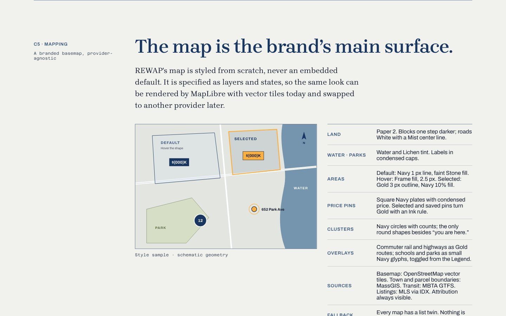

### C1 · Space and grid: structure comes from lines, not boxes

Like a plat map, the layout is divided by fine rules rather than wrapped in rounded cards.

| Token | px | Use |
|---|---|---|
| `--s1` | 4 | Hairline offsets, icon gaps |
| `--s2` | 8 | Inline gaps, chip padding |
| `--s3` | 12 | Label to value |
| `--s4` | 16 | Mobile gutter, control padding |
| `--s5` | 24 | Desktop gutter, plate padding |
| `--s6` | 32 | Between related groups |
| `--s7` | 48 | Page margin, between components |
| `--s8` | 64 | Between subsections |
| `--s9` | 96 | Above a section heading |
| `--s10` | 128 | Between major sections |

- **Desktop:** 12 columns, 48 px margins, 24 px gutters, 1344 px max. Editorial pages use a 232 px reference rail plus content.
- **Tablet:** 8 columns, 32 px margins, 20 px gutters.
- **Mobile:** 4 columns, 20 px margins, 16 px gutters. Rails collapse into a single line above the content.
- **Corners:** 0 everywhere, except the mobile bottom sheet (16 px top corners) and circular map pins.
- **Depth:** only floating map UI, `0 8px 24px rgba(15,35,66,.18)`. Everything else is flat and ruled.

### C2 · Photography: photograph the fabric of the place

Real Massachusetts, every region of it, in natural light, with materials and streets as the subject. Every frame is captioned with its place. The page holds art-directed slots for a **commissioned shoot, not stock**:

1. **Hero:** a street of three-deckers on a hill, raking winter morning light, porches stacked, utility lines left in.
2. **Material:** mill brick, close and flat-on, in a river city: Lowell, Holyoke or Worcester.
3. **Material:** painted clapboard and a porch column, shallow focus.
4. **Land:** stone wall and open field in a hill town.
5. **Water:** the coast at dusk: a South Shore harbor or a Cape marsh.

*Never:* stock families, handshakes, keys, “sold” signs, champagne; drone shots of unidentifiable suburbs; heavy filters, HDR or sepia; images that could be any city; photos that suggest who should live somewhere.

### C3 · Illustration: draw like a surveyor, not a cartoonist

Linework built from real geometry (lot lines, footprints, contours, routes), filled with material colors and hatches: **Brick** 45° hatch · **Frame** solid tint · **Stone** tint with crosshatch · **Terrain** lichen contours with a gold summit. Material is shown by hatch as well as color, so the map still reads with color vision deficiencies and in print.

### C4 · Data: a number without a source is decoration

Market data appears as **Readings**: compact, dated panels with source, period and sample size printed alongside, e.g. `Source: [MLS PIN via IDX] · Period: [Oct 2025–Sep 2026] · Area: [City or town] · n=[000]`. Navy for the series that answers the question, Stone tint for context, Gold once for “now.” Direct labels instead of legends. **No feed yet? Show the empty state, never invented numbers.**

### C5 · Mapping: the map is the brand’s main surface

Styled from scratch and specified as layers and states, so the same look renders in MapLibre with vector tiles today and can move to another provider later.

| Layer | Style |
|---|---|
| Land | Paper 2; blocks one step darker; roads White with a Mist center line |
| Water · Parks | Water and Lichen tint; labels in condensed caps |
| Areas | Default: Navy 1 px line, faint Stone fill · Hover: Frame fill, 2.5 px · Selected: Gold 3 px outline, Navy 10% fill |
| Price pins | Square Navy plates with condensed price; selected and saved pins turn Gold with an Ink rule |
| Clusters | Navy circles with counts (the only round shapes besides “you are here”) |
| Overlays | Commuter rail and highways as Gold routes; schools and parks as small Navy glyphs, toggled from the Legend |
| Sources | Basemap: OpenStreetMap vector tiles · Boundaries: MassGIS · Transit: MBTA GTFS · Listings: MLS via IDX. Attribution always visible. |
| Fallback | Every map has a list twin. Nothing is reachable only by the map. |

### C6 · Iconography

A compact set on a 24 px grid, 1.5 px stroke, square ends, like legend symbols on a plan: Search, Map, List, Layers, Draw area, Place, Save, Legend, Rail, Highway, Park, Water, School, Open house, Commute, Parcel. Icons always sit beside a word, except on the map, where the Legend explains them.

### C7 · Motion: motion explains where you are

| Token | Value | Use |
|---|---|---|
| `--dur-micro` | 120 ms | Hover color, pressed states |
| `--dur-ui` | 240 ms | Sheets, menus, filter changes, list and map sync |
| `--dur-map` | 480 ms | Region highlight, pin selection; map flyTo up to 1200 ms |
| `--ease-out` | `cubic-bezier(.16, 1, .3, 1)` | Expo out |

Signature moves: a route drawing itself (900 ms), a region lighting up (480 ms), coordinates settling as the map moves (900 ms), images revealed along a parcel edge (1100 ms). Nothing bounces. With reduced motion, the map jumps instead of flying and routes and images appear without animation.

### C8 · Components: the Atlas grammar

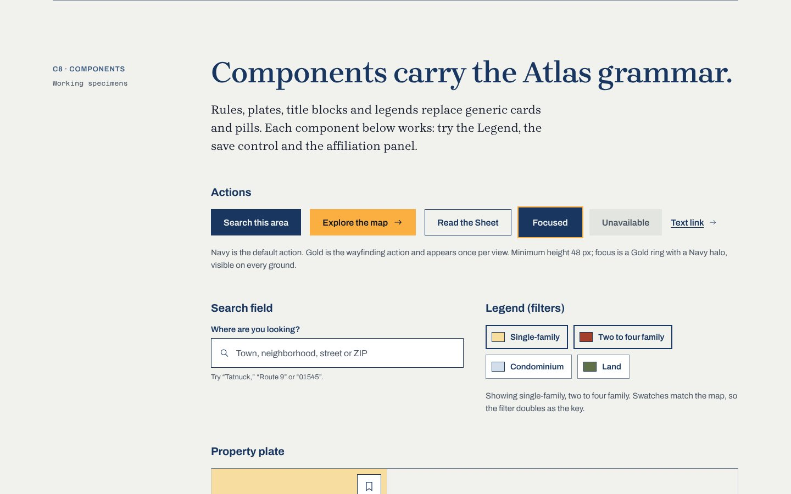

- **Actions:** Navy is the default action; Gold is the wayfinding action and appears once per view. Minimum height 48 px. Focus is a Gold ring with a Navy halo, visible on every ground.
- **Search field:** “Where are you looking?” with examples like “Tatnuck,” “Route 9” or “01545.”
- **Legend (filters):** building-type toggles whose swatches match the map, so the filter doubles as the key.
- **Property plate:** square and ruled, not a card. Price in condensed bold tabular numerals; place in map lettering; building material shown as data; **listing brokerage and MLS number always printed**, as IDX rules require; the save control is a real toggle the screen reader announces.
- **Reading:** median sale price, days on market, each with source, period and n, plus a defined empty state.
- **Title Block:** states who prepared what, the way a drawing credits its architect. It makes team and brokerage relationships explicit, for example *The Oberdorfer Group, a team affiliated with REWAP Brokerage LLC*, with REWAP as brokerage of record at equal or greater prominence. Final wording is to be confirmed against 254 CMR, MLS PIN rules and REWAP’s counsel.

### C9 · Accessibility: WCAG 2.2 AA as the floor

1. **Contrast:** body text 4.5:1 or better; large text and interface marks 3:1. Approved pairings only.
2. **The map has a list twin:** every area, pin and result is also reachable as a list, in the same order.
3. **Keyboard first:** areas, pins and clusters are focusable; arrow keys move between pins; Escape closes sheets.
4. **Visible focus:** Gold ring with Navy halo, never removed.
5. **Targets:** at least 44 × 44 px; 48 px for primary actions and map controls.
6. **Color is never alone:** materials also carry hatches and labels; states also change line weight or text.
7. **Reduced motion:** no flyTo, line draws or reveals.
8. **Describe the place:** listing photo alt text describes the space and view, never people.
9. **Plain language:** legal and financial terms explained on first use; errors name the problem and the recovery.
10. **Fair housing:** no content describes residents, suggests who belongs, or ranks schools in REWAP’s own words.

---

## Sheet D · Website concept

Explore the place, then the property.

### D1 · Home

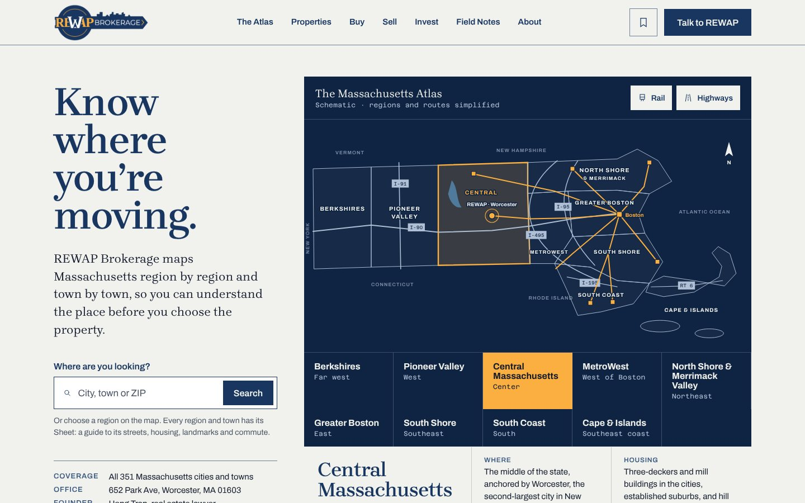

The home page opens on **The Massachusetts Atlas**: a schematic map of the state in nine regions, with rail and highway overlays that can be toggled, REWAP’s home office marked in Worcester, and a region row below the map that gives keyboard and screen-reader users the same choices. Selecting a region opens its summary (where it is, housing, getting around, landmarks) with links to its Sheet and to property search.

| Region | Direction | Anchor places |
|---|---|---|
| Berkshires | Far west | Pittsfield · North Adams · Great Barrington |
| Pioneer Valley | West | Springfield · Holyoke · Northampton · Amherst |
| Central Massachusetts | Center · home office | Worcester · Fitchburg · Leominster |
| MetroWest | West of Boston | Framingham · Natick · Marlborough |
| North Shore & Merrimack Valley | Northeast | Lowell · Lawrence · Salem · Newburyport |
| Greater Boston | East | Boston · Cambridge · Somerville · Quincy |
| South Shore | Southeast | Plymouth · Hingham · Brockton |
| South Coast | South | New Bedford · Fall River · Dartmouth |
| Cape & Islands | Southeast coast | Barnstable · Falmouth · Provincetown · Nantucket |

Below the map: the three ways in (buy, sell, invest), a filterable **gazetteer** of Massachusetts places, sample property plates (labeled), Field Notes and an introduction to REWAP. On phones the map becomes a locator without labels and the region list does the work.

### D2 · Area Sheet

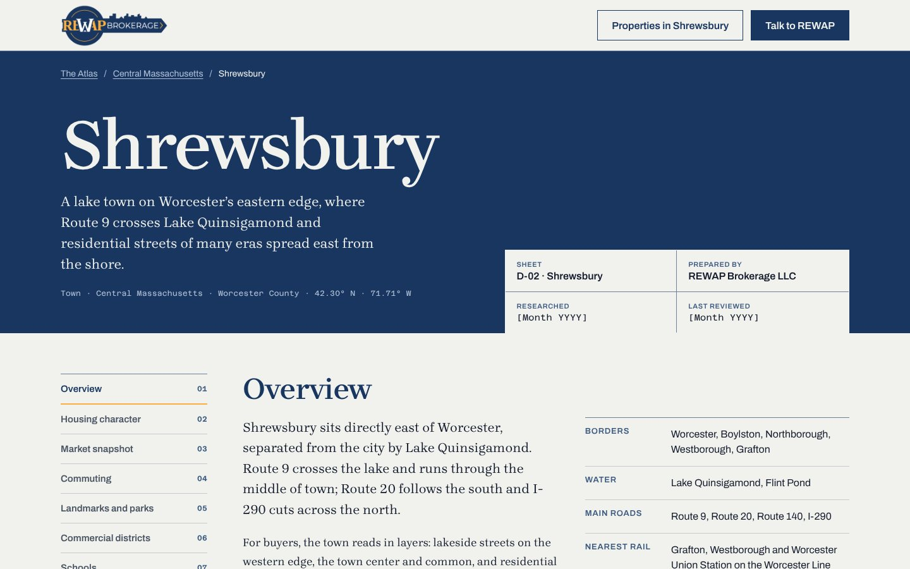

The Sheet template, shown for Shrewsbury (`/areas/shrewsbury/`): a breadcrumb that follows the Area tree (*The Atlas / Central Massachusetts / Shrewsbury*), a Title Block with researched and reviewed dates, an overview, borders, water, main roads and nearest rail, a schematic map, housing character by building type, a note *from the lawyer’s desk*, and Readings shown in their empty state until the MLS feed is connected.

### D3 · Property search

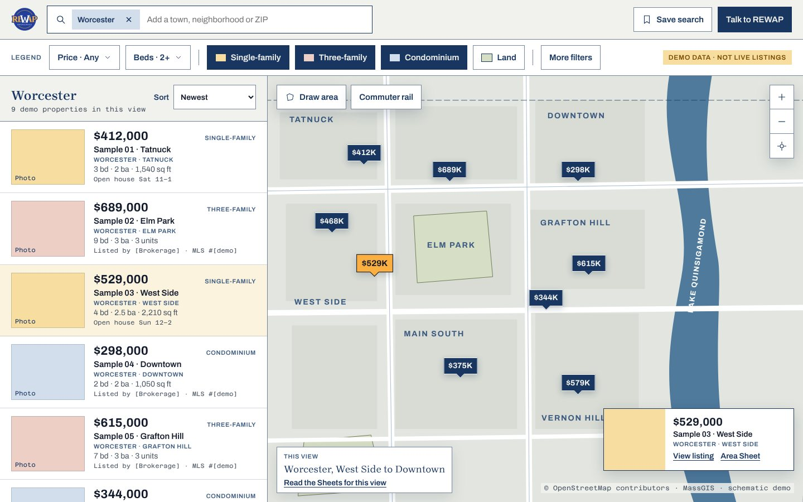

Map and list kept in sync, a Legend for filters, a drawn search area, clusters, saved searches and a “this view” panel that links to the Sheets for the area on screen. Demo view of Worcester’s West Side to Downtown; **demo listings only**.

### D4 · Listing

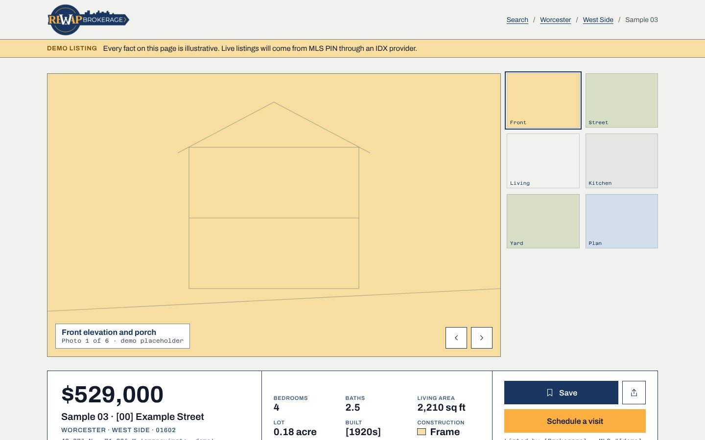

A listing placed inside its area: facts and building material, open houses, remarks written in REWAP’s voice, *The place behind it* with distances to landmarks, comparable sales of the same building type (context, not an appraisal) and *Records worth reading*: deed and plot plan, assessor’s record, building permits and zoning. **Every fact on the page is illustrative.**

### D5 · Mobile search

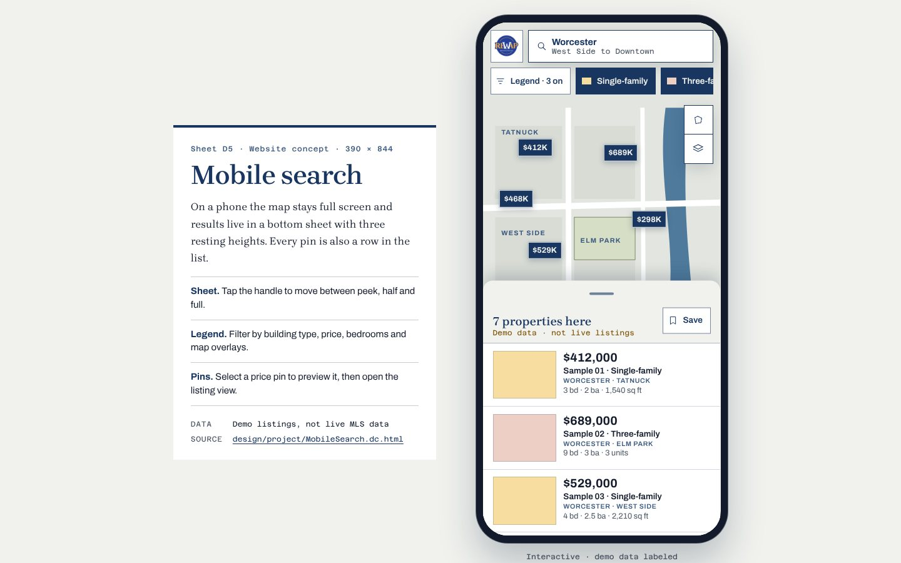

Full-screen map with a bottom sheet that rests at three heights, the Legend as its own screen (building type, price, bedrooms, map overlays) and a listing view. Shown at 390 × 844 in a phone frame; on a phone it fills the screen.

---

## Sheet E · Platform and structured data

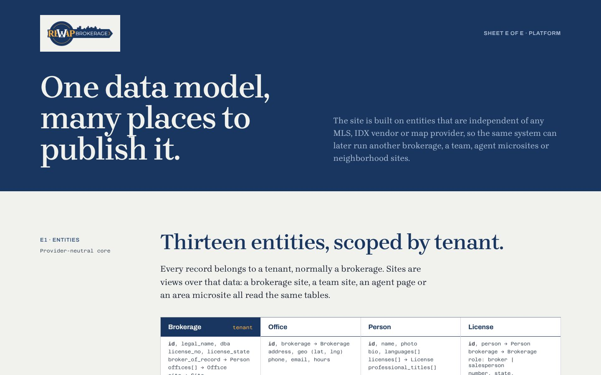

### E1 · Entities

Thirteen provider-neutral entities, scoped by tenant, so the same system can later run another brokerage, a team, agent microsites or area microsites:

`Brokerage` · `Office` · `Person` · `License` · `Team` · `Property` · `Listing` · `Area` · `Article` · `Lead` · `SavedSearch` · `IDXProvider` · `Site`

### E2 · Relationships: affiliation is data, not decoration

| Relationship | Rule |
|---|---|
| Team n : 1 Brokerage | Exactly one brokerage of record. The Oberdorfer Group → REWAP Brokerage LLC. |
| Person n : n Brokerage | Through License, which carries role and dates, so history is kept when people move. |
| Listing n : 1 Property | A property outlives its listings; price history and Sheets attach to the property. |
| Listing n : 1 Listing brokerage | May be REWAP or another firm through IDX; attribution prints either way. |
| Property n : n Area | Resolved by point-in-polygon against Area geometry. |
| Area tree | Massachusetts → Central Massachusetts → Worcester → West Side. Regions group all 351 cities and towns. |
| Article n : n Area · Person | Field Notes appear on every Sheet they are about, credited to named authors. |

IDX vendors sit behind an adapter that maps their feed to RESO Data Dictionary fields; the map style is a REWAP-owned style document with tiles, geocoding and routing behind one interface (MapLibre with OpenStreetMap vector tiles by default).

### E3 · URLs

| URL | Page |
|---|---|
| `/regions/central-massachusetts/` | Region Sheet, one per region, nine in all |
| `/areas/shrewsbury/` | City or town Sheet, one for each of the 351 |
| `/areas/worcester/west-side/` | Neighborhood Sheet, child of its city |
| `/properties/worcester/{street-slug}-{mls-id}/` | Listing, stable across status changes |
| `/search/?area=worcester&type=single-family` | Search state, shareable, never indexed |
| `/field-notes/{slug}/` | Editorial |
| `/people/{slug}/` · `/teams/{slug}/` | Agent and team pages |

### E4 · AEO / GEO

One JSON-LD graph per page with stable `@id`s, “At a glance” blocks of short sourced statements on every Sheet, `dateModified` and named authors, `sameAs` links to Wikidata and municipal pages, and `RealEstateListing` markup that always names the listing brokerage. Abridged home page graph:

```json
{
  "@context": "https://schema.org",
  "@graph": [
    {
      "@type": "RealEstateAgent",
      "@id": "https://rewapbrokerage.com/#brokerage",
      "name": "REWAP Brokerage LLC",
      "url": "https://rewapbrokerage.com/",
      "telephone": "+1-508-509-7759",
      "address": { "@type": "PostalAddress", "streetAddress": "652 Park Ave",
                   "addressLocality": "Worcester", "addressRegion": "MA", "postalCode": "01603" },
      "founder": { "@id": "https://rewapbrokerage.com/#hong-tran" },
      "areaServed": { "@type": "State", "name": "Massachusetts", "sameAs": "[Wikidata URL]" }
    },
    { "@type": "Person", "@id": "https://rewapbrokerage.com/#hong-tran", "name": "Hong Tran",
      "jobTitle": "Founder; Real Estate Lawyer", "worksFor": { "@id": "https://rewapbrokerage.com/#brokerage" } },
    { "@type": "Organization", "@id": "https://rewapbrokerage.com/teams/oberdorfer-group/#team",
      "name": "The Oberdorfer Group", "parentOrganization": { "@id": "https://rewapbrokerage.com/#brokerage" } }
  ]
}
```

---

## Ground rules

- **Places, not people.** Content describes places, buildings and services, never residents. No “safe,” “family-friendly” or “perfect for…”. No school ratings in REWAP’s own words; link to official sources only.
- **No invented proof.** No awards, rankings, testimonials, transaction counts, sales volume, team rosters or history that cannot be documented.
- **Every number has a source.** Readings stay empty rather than estimated.
- **Demo data is labeled** until IDX is live.
- **Relationships are explicit.** Brokerage, team, agent and listing-broker relationships are stated, generated from data and compliant.
- **The map is never the only way in.**

## Open items before launch

- Vector logo masters (SVG or EPS)
- Brokerage license number and broker of record
- Founder biography and portrait, approved by Hong Tran
- Agent roster, team members and their licenses
- Oberdorfer Group affiliation wording, reviewed by counsel against 254 CMR and MLS rules
- MLS PIN membership and choice of IDX vendor
- Map provider and tile hosting decision
- Commissioned photography in all nine regions
- **A statewide research plan:** every region is presented with equal weight from launch, so every region must be researched to the same depth before go-live
- Languages REWAP serves clients in, if more than English

Planned production stack: a WordPress block theme with an IDX plugin, hosted on Cloudways.

---

## Repository layout

```
.
├── index.html                 Overview page (cover, title block, directory of sheets)
├── pages/                     One small viewer page per artboard
│   ├── Main.html              Sheet A
│   ├── Identity.html          Sheet B
│   ├── System.html            Sheet C
│   ├── Home.html              D1
│   ├── Area.html              D2
│   ├── Search.html            D3
│   ├── Listing.html           D4
│   ├── MobileSearch.html      D5 phone frame
│   ├── MobileSearch-app.html  D5 app, loaded inside the frame
│   └── Platform.html          Sheet E
├── design/                    The original Claude Design files
│   ├── project/
│   │   ├── canvas.json        Canvas: pages, artboards, sizes, order
│   │   └── *.dc.html          The nine artboards
│   ├── PRODUCT.md             Product context: users, purpose, constraints, decisions
│   └── .impeccable/config.json
├── assets/
│   ├── dc-runtime.js          Renders a .dc.html artboard as a live page
│   ├── demo-nav.js            The “Atlas pages” navigator
│   └── logo/                  REWAP logo files (horizontal PNG, compact mark)
├── docs/screenshots/          Images used in this README
└── .nojekyll                  Serve files as-is on GitHub Pages
```

The canvas groups the artboards into three pages:

| Canvas page | Artboards (size) |
|---|---|
| Brand Book | Main (1440 × 5600) · Identity (1440 × 6200) · System (1440 × 7800) |
| Website | Home (1440 × 6600) · Area (1440 × 6000) · Search (1440 × 900) · Listing (1440 × 4600) · MobileSearch (390 × 844) |
| Platform | Platform (1440 × 5200) |

## How the demo works

Each artboard in `design/project/` is a Claude Design file with three parts:

- `<x-dc>` markup with `{{holes}}`, `<sc-for>` loops and `<sc-if>` conditionals
- `<helmet>` holding the page title, font links and CSS
- a `<script type="text/x-dc">` with a `class Component extends DCLogic` whose `renderVals()` returns the values and event handlers

`assets/dc-runtime.js` is a small, dependency-free interpreter for that format. A viewer page loads it and calls:

```html
<script src="../assets/dc-runtime.js"></script>
<script>DCRuntime.mount('../design/project/Home.dc.html');</script>
```

The runtime fetches the artboard, moves its `<helmet>` into the page head, renders the markup, and on every `setState()` patches the DOM in place, so typed text, focus and CSS transitions survive. Events are delegated, links between artboards (`Area.dc.html`) are rewritten to their viewer pages (`Area.html`), and uploaded canvas images (`/_blob/…`) are mapped to the files in `assets/logo/`.

Nothing is exported or flattened: **edit an artboard and the site changes with it.**

## Run it locally

The pages load their design files with `fetch()`, so they need a web server rather than `file://`:

```bash
git clone https://github.com/CptNope/REWAP-Brokerage-Concept-2.git
cd REWAP-Brokerage-Concept-2
python3 -m http.server 8000
# open http://localhost:8000
```

Any static server works (`npx serve`, `php -S localhost:8000`, etc.).

## Hosting on GitHub Pages

The site is plain static files with no build step.

1. In the repository on GitHub, open **Settings → Pages**.
2. Under **Build and deployment**, set **Source** to **Deploy from a branch**.
3. Choose branch **`main`** and folder **`/ (root)`**, then **Save**.
4. After a minute the site is live at **<https://cptnope.github.io/REWAP-Brokerage-Concept-2/>**.

Every page carries `<meta name="robots" content="noindex">` so the concept is not indexed by search engines. Remove it only if the concept is meant to be public.

## Editing the design

- **In Claude:** the canvas is the source of truth. After changes there, copy the updated `*.dc.html` files and `canvas.json` into `design/project/` and push.
- **By hand:** edit `design/project/*.dc.html` directly; refresh the page to see the change. Keep the `{{hole}}` syntax to plain dotted lookups (`{{panel.name}}`), which is all the format and the runtime support.
- **Adding an artboard:** add `design/project/New.dc.html`, copy any file in `pages/` to `pages/New.html` and change the two names in it, then add the page to the `GROUPS` list in `assets/demo-nav.js` and a card in `index.html`.

## Credits and licenses

- Concept prepared for **REWAP Brokerage LLC**, 652 Park Ave, Worcester, MA 01603. Founder: Hong Tran.
- The REWAP logo and mark are the property of REWAP Brokerage LLC and are used here unchanged.
- Fonts: [Brygada 1918](https://fonts.google.com/specimen/Brygada+1918), [Archivo](https://fonts.google.com/specimen/Archivo) and [Azeret Mono](https://fonts.google.com/specimen/Azeret+Mono), all under the SIL Open Font License, loaded from Google Fonts.
- Map geometry in the concept is schematic. Production maps will credit OpenStreetMap contributors, MassGIS and MBTA as specified on Sheet C.
- Designed with Claude, using the Impeccable design skill.
